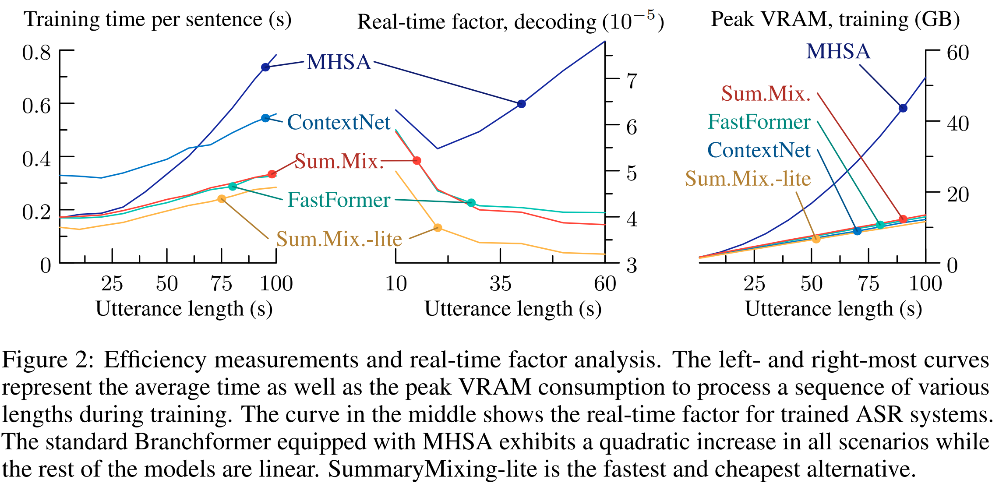

# SummaryMixing for SpeechBrain v1.0
*Halve your VRAM requirements and train 30% faster any speech model achieving equivalents or better Word Error Rates and SLU accuracies with SummaryMixing Conformers and Branchformers.*

## !! A word about using SummaryMixing with SpeechBrain V1.0 !!

The main branch of this repository will keep tracking the latest version of SpeechBrain available. Unfortunately the results reported in our [publication](https://arxiv.org/abs/2307.07421) and bellow in the Table were obtained with SpeechBrain v0.5 and may not be exactly reproduced with the current code. If you want the exact same results, please use our dedicated
[branch](https://github.com/SamsungLabs/SummaryMixing/tree/speechbrain_v0.5) that contains the code compatible with SpeechBrain v0.5!

## In brief
This repository implements SummaryMixing, a simpler, faster and much cheaper replacement to self-attention in Conformers and Branchformers for automatic speech recognition, keyword spotting and intent classification (see: the [publication](https://arxiv.org/abs/2307.07421) for further details). The code is fully compatible with the [SpeechBrain](https://speechbrain.github.io/) toolkit with version 0.5 -- copy and paste is all you need to start using SummaryMixing in your setup. If you wish to run with the latest version of SpeechBrain (v1.0+), please go to the main branch of this repository. SummaryMixing is the first alternative to MHSA able to beat it on speech tasks while reducing its complexity significantly (from quadratic to linear).

## A glance at SummaryMixing

SummaryMixing is a linear-time alternative to self-attention (SA) for speech processing models such as Transformers, Conformers or Branchformers. Instead of computing pair-wise scores between tokens (leading to quadratic-time complexity for SA), it summarises a whole utterance with mean over vectors for all time steps. SummaryMixing is based on the recent [findings](https://arxiv.org/pdf/2207.02971.pdf) demonstrating that self-attention could be useless for speech recognition as the attention weights of trained ASR systems are almost uniformly distributed accross the tokens composing a sequence. SummaryMixing also is a generalisation of the recent [HyperMixer](https://arxiv.org/abs/2203.03691) and [HyperConformer](https://arxiv.org/abs/2305.18281) to better and simpler mixing functions. In a SummaryMixing cell, that takes the same inputs and produces the same outputs than self-attention, contributions from each time step are first transformed and then averaged globally before being fed back to each time step. This is visible in Figure 1 in the [article](https://arxiv.org/abs/2307.07421). Therefore, the time-complexity is reduced to linear.

### A few results

A SummaryMixing-equipped Conformer outperforms a self-attention equivalent model on Librispeech test-clean (2.1% vs 2.3%) and test-other (5.1% vs 5.4%). This is done with a 30% training reduction as well as less than half of the memory budget (from 46GB to 21GB). Such gains are also visible with CommonVoice, AISHELL-1 and Tedlium2. This gain is also visible at decoding time as the real-time factor remains stable (does not increase) with the sentence length for a SummaryMixing Branchformer while the same model with self-attention would see its RTF following a quadratic increase. The SpeechBrain configuration files in this repository can reproduce these numbers.

The following Table gives an idea of the results observed with Librispeech. More results on CommonVoice, AISHELL, Tedlium, SLURP, and Google Speech Command are available in the [article](https://arxiv.org/abs/2307.07421).
| Encoder | Variant     | Dev-clean | Test-clean | Test-other | GPU   | VRAM |
|------------------|----------------------|--------------------|---------------------|---------------------|----------------|---------------|
|                  |                      | **WER \%**    |   **WER \%**  |   **WER \%**   | **hours** | **GB**   |
| ContextNet       | N.A.                 | 3.3                | 2.3                 | 5.9                 | 160            | 25            |
| Transformer      | Self-attention     | 3.3                | 2.3                 | 5.5                 | 129            | 40            |
| Conformer        | Self-attention     | 2.8       | 2.3                 | 5.4                 | 137            | 46            |
| Branchformer     | Self-attention     | 2.9                | 2.2                 | 5.1        | 132            | 45            |
|                  | CNN Only          | 3.1                | 2.4                 | 5.7                 | 83    | 22            |
|                  | HyperMixer         | 3.1                | 2.3                 | 5.6                 | 126            | 30            |
|                  | FastFormer         | 3.0                | 2.2                 | 5.4                 | 96             | 23            |
|                  | **Proposed**    |
| Conformer        | SummaryMixing      | 2.8       | 2.1        | 5.1        | 98             | 21   |
| Branchformers    | SummaryMixing-lite | 3.0                | 2.2                 | 5.2                 | 98             | 23            |
|                  | SummaryMixing      | 2.9                | 2.2                 | 5.1        | 105            | 26            |
|                  | +Summary Decoder   | 3.1                | 2.3                 | 5.3                 | 104            | 26            |





## Citation

Please cite SummaryMixing as follows:
```bibtex
@misc{summarymixing,
  title={{SummaryMixing}: A Linear-Complexity Alternative to Self-Attention for Speech Recognition and Understanding},
  author={Titouan Parcollet and Rogier van Dalen and and Shucong Zhang and Sourav Bhattacharya},
  year={2023},
  eprint={2307.07421},
  archivePrefix={arXiv},
  primaryClass={eess.AS},
  note={arXiv:2307.07421}
}
```

## Licence
This code is distributed under the CC-BY-NC 4.0 Licence. See the [Licence](https://github.com/SamsungLabs/SummaryMixing/blob/main/LICENCE.md) for further details
